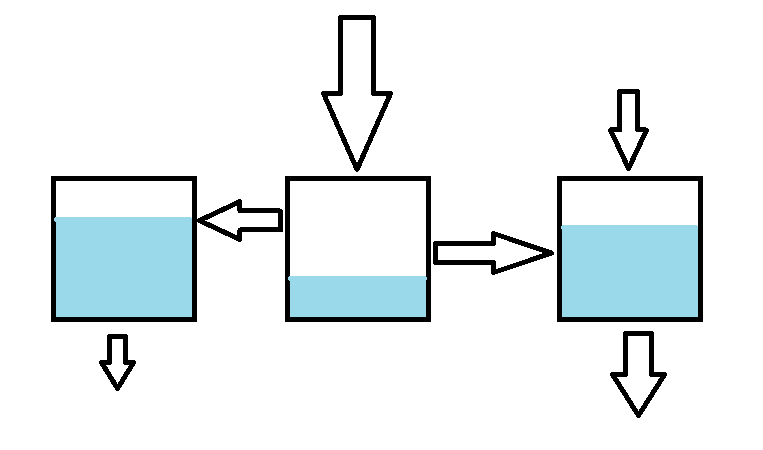

# Differentiaaliyhtälöryhmät

Differentiaaliyhtälöistä voidaan muodostaa yhtälöryhmiä samaan tapaan kuin muunkinlaisista yhtälöistä. Esimerkiksi kemianteollisuuden prosesseissa on mukana monta yhtä aikaa muuttuvaa osaa, kuten paine, lämpötila, aineiden konsentraatio ja muut olosuhteet. Jonkin tekijän muutos vaikuttaa muihin tekijöihin. Niinpä prosessin kuvaamiseen tarvitaan useampaa kuin yhtä differentiaaliyhtälöä.

## Yhtälöryhmän ratkaisu

Tarkastellaan ilmiötä, johon liittyy ajasta $t$ riippuvat funktiot $x_1(t)$ ja $x_2(t)$. Tässä on tärkeää huomata, että $x$ on nyt funktion eikä muuttujan nimi. Funktioita voidaan nimetä myös eri kirjaimilla kuten $x(t), y(t), z(t), \dots$.

Oletetaan, että funktiot $x_1(t), x_2(t), \dots$ sekä niiden derivaatat riippuvat toisistaan sekä muuttujasta $t$. Oletetaan lisäksi, että riippuvuus on lineaarista siten, että funktiot, derivaatat ja muuttuja esiintyvät yhtälössä ainoastaan vakioilla kerrottuina, eivät esimerkiksi muodossa $x_1 x_2$ tai $(x_2')^2$. Lisäksi derivaatat ovat ensimmäisiä derivaattoja $x_1'(t), x_2'(t)$ jne. Tällöin yhtälöryhmän ratkaisussa voidaan käyttää samoja menetelmiä kuin yleensäkin: sijoitus- ja eliminaatiomenetelmää. Voit halutessasi kerrata ne [Lineaarialgebran](https://luma-lapinamk.github.io/minna-lineaarialgebra/yhtaloryhmat_kertaus.html) oppimateriaalista.

Yleisesti yhtälöryhmän ratkaisussa pyritään vähentämään yhtälöissä esiintyviä tuntemattomia, kunnes jokin tuntemattomista saadaan selville. Differentiaaliyhtälöryhmästä pitäisi saada muokattua  yhtälö, jossa esiintyy jokin funktio $x_n$ ja mahdollisesti sen derivaatta $x_n'$ ja tuntematon $t$, mutta ei mitään muuta funktiota $x_m$ eikä sen derivaattaa $x_m'$. Differentiaaliyhtälöryhmien ratkaisemisessa tarvitaan myös puolittain derivointia ja integrointia. Tutustu seuraaviin esimerkkeihin!

::::{admonition} Esimerkki

Ratkaise **eliminaatiomenetelmällä** ohjeen mukaan differentiaaliyhtälöpari

$\begin{equation}\begin{cases}x_1'-x_1+x_2'=2t+1 \\ 2x_1'+x_1+2x_2'=t\end{cases}\end{equation}$

- Aloita kertomalla ylempi yhtälö luvulla -2.
- Laske sitten yhtälöt yhteen puolittain.
- Saat differentiaaliyhtälön, jossa tuntemattomana on vain $x_1$.
- Ratkaise $x_1$. Sen jälkeen sijoita se jompaankumpaan yhtälöön ja ratkaise $x_2$.

:::{admonition} Ratkaisu
:class: tip, dropdown

Kertomalla ylempi yhtälö luvulla -2 yhtälöpari muuttuu muotoon

$\begin{equation}\begin{cases}-2x_1'+2x_1-2x_2=-4t-2 \\ 2x_1'+x_1+2x_2'=t\end{cases}\end{equation}$

Lasketaan yhtälöt yhteen, jolloin jäljelle jää yhtälö:

$3x_1=-3t-2$

Ratkaistaan yhtälöstä $x_1$ eli funktio $x_1(t)$ jakamalla yhtälön molemmat puolet luvulla 3:

$x_1(t)=-t-\frac{2}{3}$

Funktio $x_1(t)$ on nyt ratkaistu. Ylemmässä yhtälössä esiintyy myös sen derivaatta, joten lasketaan se:

$x_1'(t)=-1$

Ratkaistaan alkuperäisen differentiaaliyhtälöparin ylemmästä yhtälöstä $x_2'$ (sen voisi ratkaista myös alemmasta yhtälöstä, mutta ensimmäisessä yhtälössä ratkaisu on lyhyempi):

$x_2'=2t+1-x_1'+x_1$

Sijoitetaan yhtälöön äsken ratkaistut $x_1(t)$ ja $x_1'(t)$ ja sievennetään:

$x_2'(t)=2t+1-(-1)+(-t-\frac{2}{3})$

$x_2'(t)=2t+1+1-t-\frac{2}{3}$

$x_2'(t)=t+\frac{4}{3}$

Kyseessä on integroituva differentiaaliyhtälö, joten $x_2(t)$ ratkeaa integroimalla yhtälön molemmat puolet:

$x_2(t)=\int t+\frac{4}{3} \,dt + C$

$x_2(t)=\frac{1}{2}t^2+\frac{4}{3}t+C$

:::

::::

::::{admonition} Esimerkki

Ratkaise **sijoitusmenetelmällä** ohjeen mukaan differentiaaliyhtälöpari

$\begin{equation}\begin{cases} x_2'=2x_2-2x_1 \\ x_1'=-x_2+3x_1 \end{cases}\end{equation}$

- Ratkaise alemmasta yhtälöstä $x_2$ ilmaistuna funktion $x_1$ avulla.
- Derivoi ratkaisun molemmat puolet, jolloin saat derivaatan $x_2'$ ilmaistuna derivaatan $x_1'$ avulla.
- Sijoita $x_2$ ja $x_2'$ ylempään yhtälöön, jolloin saat ratkaistavissa olevan differentiaaliyhtälön.

:::{admonition} Ratkaisu
:class: tip, dropdown

Alemmasta yhtälöstä saadaan $x_2=3x_1-x_1'$. On tärkeää huomata, että nyt tiedossa ei ole funktion $x_2(t)$ lauseke, vaan funktion $x_2(t)$ riippuvuus funktiosta $x_1(t)$ ja sen derivaatasta.

Derivoidaan yhtälön $x_2=3x_1-x_1'$ molemmat puolet. Derivaatoillekaan ei saada vielä muuttujan $t$ avulla ilmaistuja lausekkeita, vaan lopputuloksena on ainoastaan derivaatan $x_2'(t)$ riippuvuus funktion $x_1(t)$ derivaatoista. Derivointi tapahtuu yksinkertaisesta lisäämällä funktion nimen perään derivaatan tunnus ' ja jos sellainen on jo valmiiksi, niin toinenkin.

$x_2'=3x_1'-x_1''$

Sijoitetaan tämä riippuvuus differentialiyhtälöparin ensimmäiseen yhtälöön ja sievennetään:

$x_2'=2x_2-2x_1$

$3x_1'-x_1''=2(3x_1-x_1')-2x_1$

$3x_1'-x_1''=6x_1-2x_1'-2x_1$

$3x_1'-x_1''=4x_1-2x_1'$

$-x_1''+5x_1'-4x_1=0$

Nyt tuloksena on toisen kertaluvun differentiaaliyhtälö. Se voitaisiin ratkaista aiemmin opituilla menetelmillä. Tällöin saataisiin ratkaisu $x_1(t)$, jonka lauseketta käyttäen saataisiin selville myös $x_2(t)$. 

:::

::::

::::{admonition} Esimerkki

Ratkaise yhtälöpari

$\begin{equation} \begin{cases} y'=2y-2x \\ x'=-y+3x \end{cases} \end{equation} $

:::{admonition} Ratkaisu
:class: tip, dropdown

Ratkaisemalla alempi yhtälö funktion $y$ suhteen saadaan $y=-x'+3x$. Kun tämä yhtälö derivoidaan molemmin puolin, niin saadaan $y'=-x''+3x'$. Sijoittamalla nämä kaksi yhtälöä yhtälöparin ylempään yhtälöön päädytään sellaiseen differentiaaliyhtälöön, jossa on vain yksi tuntematon funktio: 

$-x''+3x'=2(-x'+3x)-2x $

$-x''+3x'=-2x'+6x-2x $

$-x''+5x'-4x=0 $

Nyt kyseessä on homogeeninen toisen kertaluvun differentiaaliyhtälö. Sitä vastaavan karakteristisen yhtälön $-m^2+5m-4=0$ juuret ovat $1$ ja $4$, joten differentiaaliyhtälön ratkaisuksi tulee $x(t)=C_1 e^t + C_2 e^{4t}$.

Yhtälö $y(t)$ saadaan ratkaistua sijoittamalla ratkaisu $x(t)$ ja sen derivaatta $x'(t)=C_1 e^t + 4 C_2 e^{4t}$ yhtälöön $y=-x'+3x$

$y(t)= -C_1 e^t -4 C_2 e^{4t} +3 C_1 e^t +3 C_2 e^{4t}$

$y(t)= 2C_1 e^t - C_2 e^{4t}$

:::

::::

## Sovelluksia

**Saaliit ja pedot: Lotka-Volterra -malli**

Luonnossa samalla alueella voi elää sekä petoja että saaliita. Näiden eläinlajien määrät vaikuttavat toisiinsa: jos saaliita on paljon, pedoille riittää syötävää ja niiden poikaset menestyvät hyvin. Samalla kuitenkin saaliiden määrä pienenee ja sitä mukaa pedoille riittää vähemmän ravintoa. Kun petojen määrä pienenee, saaliiden määrä voi taas kasvaa. 

Merkitään petojen määrää ajan $t$ funktiona $y(t)$ ja saaliiden määrää $x(t)$. Jos petoja ei olisi, niin saaliiden määrä kasvaisi eksponentiaalisesti yhtälön $x'=ax, a > 0$ mukaisesti. Jos taas saaliita ei olisi, niin petojen määrä vähenisi eksponentiaalisesti yhtälön $y'=-by, b > 0$ mukaisesti. Jos taas sekä petojen että saaliiden määrä on suurempi kuin nolla, niin ns. [Lotka-Volterra](https://fi.wikipedia.org/wiki/Lotkan%E2%80%93Volterran_yht%C3%A4l%C3%B6) -mallin mukaan yhtälöiksi muodostuvat

(1) $x'=ax-cxy$,

(2) $y'=-by+dxy$

joissa vakiot $c > 0, d > 0$ liittyvät petojen ja saaliiden välisiin kohtaamisiin. Tällaisessa kohtaamisessahan saalis saattaa tulla syödyksi ja peto taas voi saada populaation kasvattamiseen tarvittavaa ravintoa. Kohtaamisten lukumäärän oletetaan mallissa riippuvan petojen ja saaliiden määrän tulosta $xy$.

Kyseistä differentiaaliyhtälöä ei voi ratkaista analyyttisesti. Tietokoneella ratkaisu kyllä onnistuu.

**Sekoitusongelmat**

Differentiaaliyhtälöryhmiin voi päätyä, jos on tarve tarkastella aineiden virtausta esimerkiksi säiliöstä toiseen. Säiliöissä voi olla esimerkiksi teollisuudessa käytettäviä kemikaaleja tai säiliöt voivat olla ihan tavallisia järviä. Säiliöt ovat yhteydessä toisiinsa esimerkiksi putkien tai jokien välityksellä. Säiliöihin voi virrata ainetta muista säiliöistä tai ulkopuolelta (esim. sadevetenä järveen) ja säiliöstä voi virrata ainetta toisiin säiliöihin tai kokonaan ulos systeemistä. 

Kuvassa on esimerkki, jossa on kolme säiliöstä. Niistä kahteen virtaa ainetta ulkopuolelta ja kahdesta poistuu ulos systeemistä. Muutoin virtaus tapahtuu säiliöiden välillä. Tällaisia systeemejä voidaan mallintaa muodostamalla lauseke jokaisessa säiliössä olevan aineen määrän muuttumiselle. Muuttumista integroimalla päästään lopulta säilöissä olevan aineen määrään. Tällaisia ongelmia kutsutaan virtaus- tai sekoitusongelmiksi. Ongelmissa  voi olla mukana myös aineiden pitoisuuksia, esimerkiksi kuvan säiliöihin virtaavissa aineissa voisi olla erilaisia suolapitoisuuksia, ja tällöin tavoitteena olisi laskea säiliöissä olevan suolan, eikä suolaveden, massa. Oppitunneilla harjoitellaan tällaisten ongelmien ratkaisua.

## Korkeamman kertaluvun differentiaaliyhtälön ratkaisu

Laskentaohjelmat muuttavat korkeamman kertaluvun differentiaaliyhtälöt useaksi ensimmäisen kertaluvun differentiaaliyhtälöksi. Yhtälöitä tulee niin monta kuin on differentiaaliyhtälön kertaluku. Tarkastellaan tässä, miten muunnos tapahtuu.

Oletetaan, että differentiaaliyhtälössä esiintyy tuntematon funktio $x(t)$ ja sen derivaattoja. Määritellään funktio uudelleen apumuuttujalla $x_1=x$. Tuntemattoman funktion derivaatta $x'(t)$ nimetään uudelleen $x_2=x'$. Näin tehdään niin kauan, että on nimetty kaikki paitsi korkein differentiaaliyhtälössä esiintyvä derivaatta. Esimerkiksi toisen kertaluvun differentiaaliyhtälössä riittää nämä kaksi apumuuttujaa $x_1$ ja $x_2$.

Seuraavaksi derivoidaan kaikki apumuuttujat. Toisen kertaluvun differentiaaliyhtälössä nämä derivaatat ovat $x_1'=x'$ ja $x_2'=x''$. Sijoitetaan nämä alkuperäiseen differentiaaliyhtälöön. Näin saadaan yksi differentiaaliyhtälö muodostuvaan differentiaaliyhtälöpariin. Toinen differentiaaliyhtälö saadaan määritelmästä $x_1'=x_2$. Muodostunut differentiaaliyhtälöpari voidaan ratkaista aiemmin esitellyillä menetelmillä. 

::::{admonition} Esimerkki

Muunna differentiaaliyhtälö $x''+2x'-4x=3t$ ryhmäksi ensimmäisen kertaluvun differentiaaliyhtälöitä.

:::{admonition} Ratkaisu
:class: tip, dropdown

Määritellään apumuuttujat $x_1=x$ ja $x_2=x'$. Näiden derivaatat ovat $x_1'=x'$ ja $x_2'=x''$. Nyt alkuperäinen yhtälö muuttuu muotoon $x_2'+ 2 x_2+-4x_1=3t$ ja lisäksi voidaan muodostaa yhtälö $x_1'=x_2$. Saadaan siis yhtälöpari

$\begin{equation} \begin{cases} x_1'=x_2 \\x_2'+ 2 x_2-4x_1=3t\end{cases} \end{equation}$

Yhtälöparin ratkaisua ei tarkastella tässä.

:::

::::